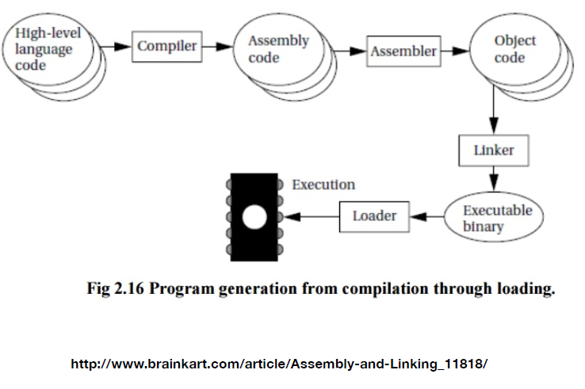
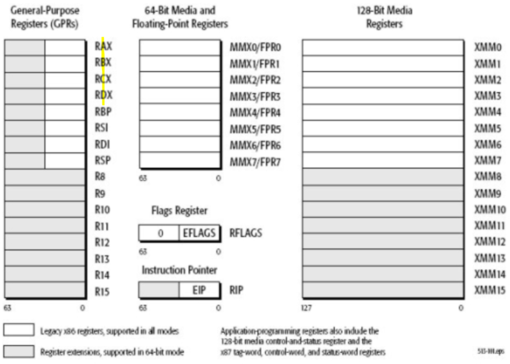
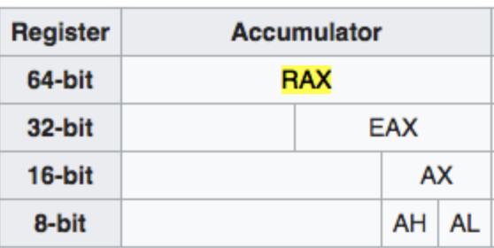
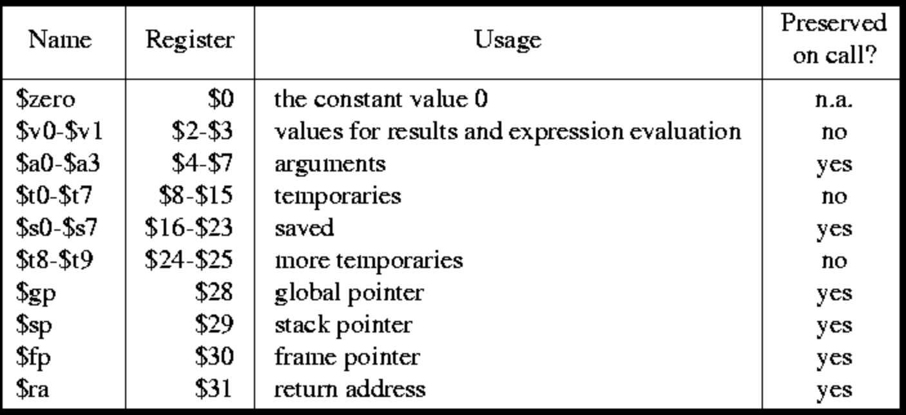
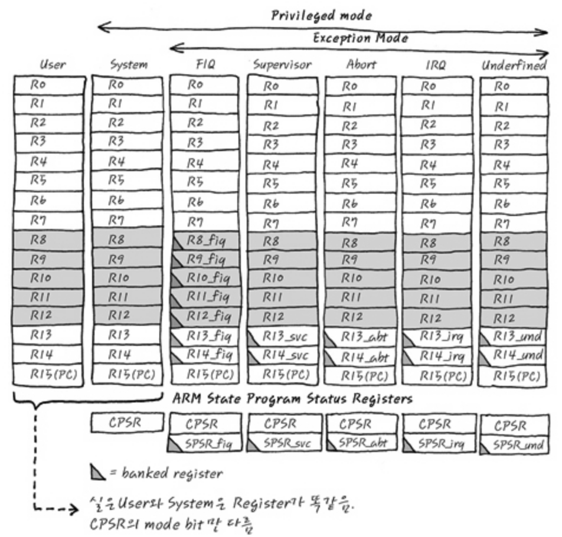

 **주의사항** 본 자료는 복습을 위한 Review 자료이며, 문제 시 삭제됩니다.
{: .notice}

## 1. Assembly ?
<pre>
* 프로그래밍 언어 중 하나.
* 기계어와 일대일 대응.
* 기계어는 CPU의 ISA마다 따라 다르기 때문에 명령어 규격이 없음. ISA : 명령어 집합 구조 (Instruction Set Architecture)
</pre>

### Flowchart
Binary Code -> Hex Code -> Assembly

<pre>
본 자료에서는 Intel 문법을 사용함. 
Intel 메뉴얼 참고자료 : <https://software.intel.com/en-us/articles/intel-sdm>
</pre>

## 2. Ubuntu Linux에서 실제 어셈블과 링킹을 해보자.

### Flowchart
<figure>
	
</figure>

실습 환경 : NASM(Netwide Assembler)과 gcc가 설치된 Ubuntu Linux.

### Test
~~~assembly
#test.asm
global _start

section .text
_start:
	push rbp
	mov rbp, rsp
	
	mov rsp,rbp
	ret
~~~

해당 파일을 작성한 후, 
	
	nasm -felf64 test.asm 
	
명령을 이용하여 어셈블 해준 다음 
	
	ld -o test test.o
	
명령을 이용하여 링킹해준다.

그렇게하면 test파일과 test.o파일이 생성된다. 
test파일을 실행해보면 아래와 같이 세그먼트 오류가 나는 것을 확인할 수 있다.
	
	
	Segmentation fault (core dumped)
	

### Hello World
~~~assembly
#hello.asm
global _start

section .text
_start :
	mov rax, 1
	mov rdi, 1
	mov rsi, message
	mov rdx, 14
	syscall
	mov rax, 60
	xor rdi, rdi
	syscall

section .data
message: db "Hello, World!", 10
~~~

위의 파일을 작성하고, test와 마찬가지로 어셈블과 링킹을 해주고, Hex Code를 확인해보자. 

	
	objdump -M intel -d hello
	
명령을 실행해보면 다음과 같은 Hex Code를 확인할 수 있다.

	
	
	hello:     file format elf64-x86-64

	
	Disassembly of section .text:

	00000000004000b0 <_start>:
	  4000b0:	b8 01 00 00 00       	mov    eax,0x1
	  4000b5:	bf 01 00 00 00       	mov    edi,0x1
	  4000ba:	48 be d8 00 60 00 00 	movabs rsi,0x6000d8
	  4000c1:	00 00 00 
	  4000c4:	ba 0e 00 00 00       	mov    edx,0xe
	  4000c9:	0f 05                	syscall 
	  4000cb:	b8 3c 00 00 00       	mov    eax,0x3c
	  4000d0:	48 31 ff             	xor    rdi,rdi
	  4000d3:	0f 05                	syscall 
	

Hex Code를 보면 rax를 사용했지만 eax가 사용된 것을 확인할 수 있는데, 이 부분은 레지스터가 알아서 사이즈 조절을 한 것이다.

## 3. 레지스터
<pre>
* 하드웨어적으로 구현됨.
* 이름 변경 불가
* CPU 종류별로 레지스터 이름이 다 다르다.
* 레지스터 이름별로, 용도가 다 다르다.
</pre>

## 4. x64 레지스터

### x64 레지스터의 전체 구조
<figure>
	
</figure>

| RAX | 함수 반환값에 사용 |
| RBX | 메모리 주소 지정. RSI, RDI와 함께 |
| RCX | loop counter로 사용 |
| RDX |  |
| RBP | 현재 함수의 Base Pointer |
| RSI | 문자열 관련 Instruction 사용 시, Source |
| RDI | 문자열 관련 Instruction 사용 시, Destination |
| RSP | 현재 스택 최상위를 가리킴. Push/Pop에 의해 항상 바뀜. |
| RIP | 다음에 수행될 코드 영역을 가리키고 있음. |

### x64 레지스터 Accumulatar
<figure>
	<a href="../assets/img/x64-1.png">
  
</figure>
RBX, RCX, RDX도 위와 같다. 
RSI는 esi(32), si(16), sil(8)이다. 
R8은 r8d(32), r8w(16), r8b(8)이다. 

## 참조

### MIPS 레지스터
<figure>
	
</figure>

### ARM core 레지스터
<figure>
	
</figure>

## 5. x64 레지스터 명령어
<pre>
* 중요 명령어
| PUSH/POP | 스택 최상위에 값 넣음; RSP 레지스터 증가. 스택 최상위에서 값 빼옴; RSP 레지스터 감소. |
| ADD/SUB/MUL/DIV | 더하기/빼기/곱하기/나누기. eflags에 상당한 영향을 주는 명령어. |
</pre>
<pre>
| MOV | 값 이동 |
| LEA | 주소 이동 |
| CMP | 비교 |
| TEST | 비교 |
| JMP | JMP 다음에 오는 LABEL, 프로시저로 이동 |
| CALL | CALL 다음에 있는 주소를 호출. CALL 다음 명령어 주소를 스택에 PUSH함. |
| RET | RSP가 가리키고 있는 값으로 점프. ==> 스택 최상위 값으로 JUMP. ==> RSP를 8 증가시킨다. |
| JZ | JZ, JE, JLE, JGE, JL, JG, JS, JNS |
| REP | 다른 명령어 앞에. RCX 레지스터를 1씩 감소시키면서 문자열 관련 명령어를 처리. |
| STOS | AX를 EDI가 가리키는 주소에 넣음. rep stos byte ptr [EDI] |
| SCAS | AX에 저장되있는 값과 EDI가 가리키는 곳에 저장된 값을 비교. |
</pre>

## 6. Stack(스택)
<pre>
* 함수 호출
* 지역 변수 저장 및 사용
* 함수 인자 전달(7번째 인자부터)
* ...
</pre>

### 스택관련 레지스터
<pre>
RSP
 * 항상 스택 최상위.
 * PUSH/POP에 의해 증감.
</pre>
<pre>
RBP
 * 현재 변수 안에서 변수들의 기준점이 됨.
</pre>

### 중요 레지스터
<pre>
Return Address a.k.a RET(Instruction 아님.)
  * 함수 종료 후, 돌아갈 주소
</pre>
<pre>
(Stack||Saved) Frame Pointer a.k.a SFP
  * Caller함수의 RBP 값을 가짐.
